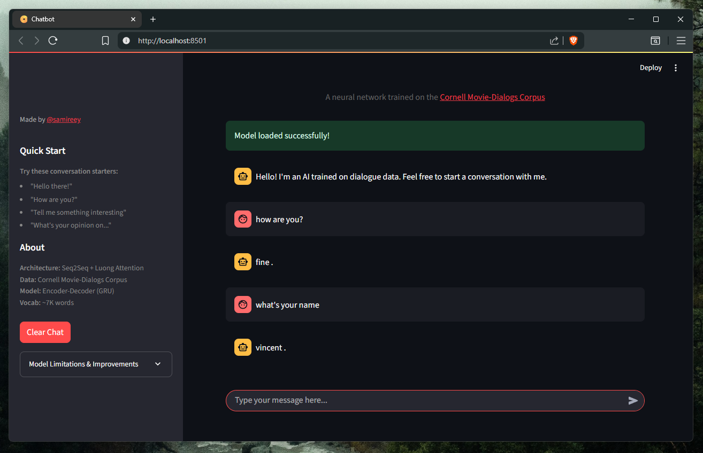

<!--  -->
## Download the Model
You can get the model from [Hugging Face]([https://huggingface.co/paudelsamir/my-checkpoints/tree/main]).

Just clone the project and run locally !

## Demo
Check out how it works:

[<video controls src="demo.mp4" title="Title"></video>](https://github.com/user-attachments/assets/34fbf8b2-b575-407a-9b67-57ec68c59514)
